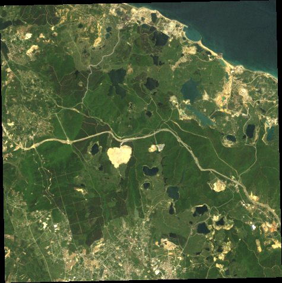
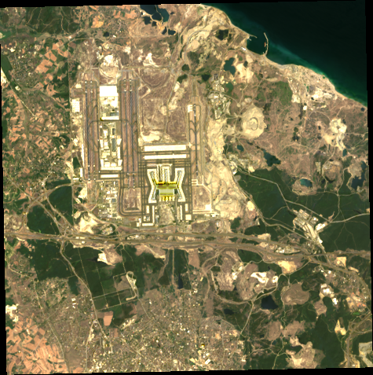
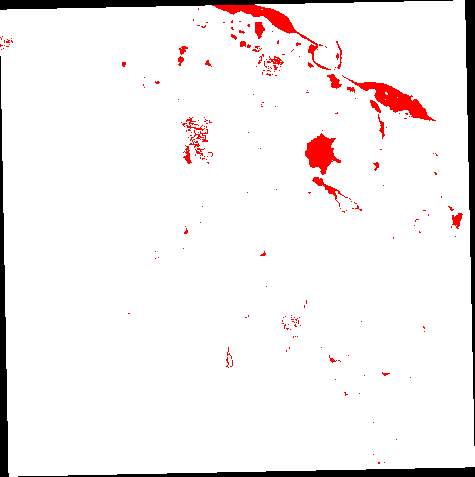
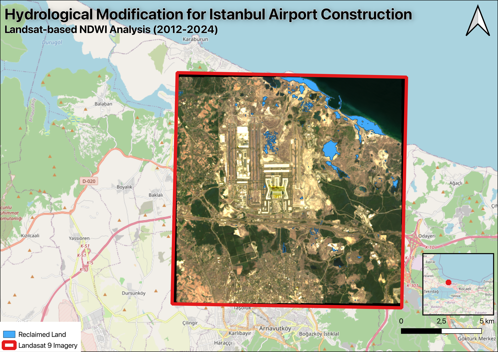

# Istanbul Airport — Land Reclamation Analysis

**University of Antwerp** · Geographical Information Systems (GIS) · Academic Year 2025/2026  
**Tool:** Google Earth Engine · [Open Script ↗](https://code.earthengine.google.com/e9c72566d45c96661dddc95ead646f67)

---

## Table of Contents

1. [Introduction](#1-introduction)
2. [Data & Methods](#2-data--methods)
   - [Study Area](#21-study-area)
   - [Satellite Imagery](#22-satellite-imagery)
   - [NDWI Calculation](#23-ndwi-calculation--water-classification)
   - [Quantification](#24-water-to-land-conversion-quantification)
3. [Results](#3-results)
4. [Conclusion](#4-conclusion)
5. [References](#5-references)

---

## 1. Introduction

Istanbul Airport, inaugurated in **October 2018**, is one of the world's largest aviation hubs with a capacity exceeding **200 million passengers annually**. Its construction required extensive coastal modification along the Black Sea shoreline, including significant land reclamation from marine areas.

> **Research question:** *How much land had to be gained from the sea to build Istanbul Airport compared to 2012?*

> **Important note:** The NDWI-based classification detects **all water bodies** within the study area — coastal marine waters *and* inland features such as lakes, ponds, wetlands, and temporary water accumulations. The analysis therefore quantifies the total conversion of **water-covered areas to terrestrial land cover** between pre-construction (2012) and post-construction (2024) periods.

---

## 2. Data & Methods

### 2.1 Study Area

A **6 km buffer** around Istanbul Airport (41.26°N, 28.75°E) on the European side of Istanbul, along the Black Sea coast.

---

### 2.2 Satellite Imagery

Two Landsat datasets capture the before/after construction state:

| Period | Sensor | Collection | Date Range | Cloud Filter |
|--------|--------|------------|------------|--------------|
| Pre-construction | Landsat 5 TM | C2 L2 | 2011–2012 | < 50% |
| Post-construction | Landsat 9 OLI-2 | C2 L2 | 2023–2024 | < 50% |

> Landsat 5 was selected for its availability and absence of scan-line errors. Landsat 9 provides improved radiometric performance with updated band designations relative to Landsat 8.

<table>
  <tr>
    <td align="center"> <b>Landsat 5 · True Color · 2012</b></td>
    <td align="center"> <b>Landsat 9 · True Color · 2024</b></td>
  </tr>
</table>

---

### 2.3 NDWI Calculation & Water Classification

The **Normalized Difference Water Index (NDWI)** distinguishes water from land using the contrast between visible green and near-infrared (NIR) reflectance:

$$\text{NDWI} = \frac{\text{Green} - \text{NIR}}{\text{Green} + \text{NIR}}$$

Band assignments by sensor:

| Sensor | Green Band | NIR Band |
|--------|-----------|---------|
| Landsat 5 | Band 2 (`SR_B2`) | Band 4 (`SR_B4`) |
| Landsat 9 | Band 3 (`SR_B3`) | Band 5 (`SR_B5`) |

A threshold of **NDWI > 0** classifies pixels as water (1) or land (0), producing binary rasters for both 2012 and 2024.

---

### 2.4 Water-to-Land Conversion Quantification

Water-to-land conversion was identified by **subtracting the 2024 water mask from the 2012 water mask**: pixels classified as water in 2012 but land in 2024 represent converted areas.

The total was computed using `reduceRegion` with `Reducer.sum()` at **30 m resolution**. Area was converted from pixel count to km² using:

$$\text{Area (km}^2\text{)} = \text{pixel count} \times \frac{30 \times 30}{10^6}$$

---

## 3. Results

The map below shows the spatial distribution of water-to-land conversion within the study area. **Red pixels** indicate areas classified as water in 2012 that became terrestrial land by 2024, concentrated around the airport footprint.

  
   
  <b>Water-to-land conversion (red) · Istanbul Airport · 2012 → 2024</b>

 

Quantitative results are summarized below:

| Parameter | 2012 | 2024 |
|-----------|------|------|
| Water area (km²) | 8.73 | 6.32 |
| **Water-to-land conversion (km²)** | **—** | **2.41** |

> Approximately **2.41 km²** of water-covered areas were converted to terrestrial land within this area between 2012 and 2024, reflecting drainage of inland water bodies and Black Sea coastal infilling.

 

  
   
  <b>Hydrological modification map for Istanbul Airport construction</b>

---

## 4. Conclusion

Using **Landsat time-series analysis** and **NDWI-based water classification** in Google Earth Engine, approximately **2.4 km² of water-covered areas were converted to terrestrial land** for Istanbul Airport construction between 2012 and 2024.

This reflects substantial hydrological modification including:
- Black Sea **coastal infilling**
- **Drainage** of inland water bodies (lakes, ponds, wetlands)

The analysis demonstrates the utility of remote sensing for monitoring large-scale land cover changes associated with infrastructure development.

---

## 5. References

- Istanbul Airport. *About Istanbul Airport*. https://www.istanbulairport.com/ (Accessed: January 2026).
- Wang, W., Liu, H., Li, Y., & Su, J. (2014). Development and management of land reclamation in China. *Ocean & Coastal Management*, 102, 415–425.
- McFeeters, S. K. (1996). The use of the Normalized Difference Water Index (NDWI) in the delineation of open water features. *International Journal of Remote Sensing*, 17(7), 1425–1432.
- Temmerman, S., Belliard, J.-P., & Slootmaekers, B. (2025/2026). *Geographical Information Systems (2001WETGIS)*. University of Antwerp, Faculty of Science, Department of Biology.

---

  Google Earth Engine Script · <a href="https://code.earthengine.google.com/e9c72566d45c96661dddc95ead646f67">code.earthengine.google.com</a>

